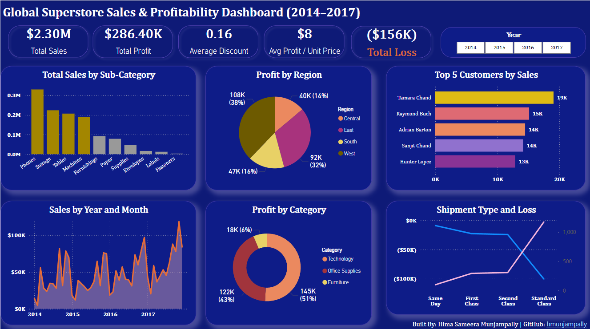

# 🧠 Global Superstore Sales & Profitability Dashboard (2014–2017)

This Power BI dashboard analyzes 4 years of sales, profit, discount patterns, and shipment types using the Global Superstore dataset. It provides deep insights into performance across product categories, regions, customer segments, and shipping modes — including unprofitable orders.

---

## 📊 Features

- ✅ Total Sales, Profit, Discount, and Profit/Unit KPIs
- 📉 Shipment Mode Loss Analysis
- 📦 Profit by Category & Sub-Category
- 📍 Region-wise Performance
- 📈 Sales Trend by Month & Year
- ⚠️ Loss Metrics by Product and Delivery Type
- 🎯 Drillthroughs & Filters (Year, Category, Region)

---
## 📹 Demo Video
Watch it here: [Click to view](https://www.linkedin.com/posts/hima-sameera-munjampally-16893b171_powerbi-dataanalytics-dashboarddesign-activity-7317424282790162432-E4pu?utm_source=share&utm_medium=member_desktop&rcm=ACoAACjlOiABZ27BIxBHXPJPVNtzrfYH53KKa2k)

---

## 🛠 Tools Used

- Microsoft Power BI
- DAX (Data Analysis Expressions)
- Excel (for data modeling)
- Git & GitHub

---

## 📸 Screenshot

---

## 🚀 How to Use

1. Clone this repo
2. Open `Global-Superstore-Dashboard.pbix` in Power BI Desktop
3. Explore the filters and visualizations!

---

## 👩‍💻 Built By

**Hima Sameera Munjampally**  
GitHub: [hmunjampally](https://github.com/hmunjampally)  
LinkedIn: (https://www.linkedin.com/in/hima-sameera-munjampally-16893b171/))

